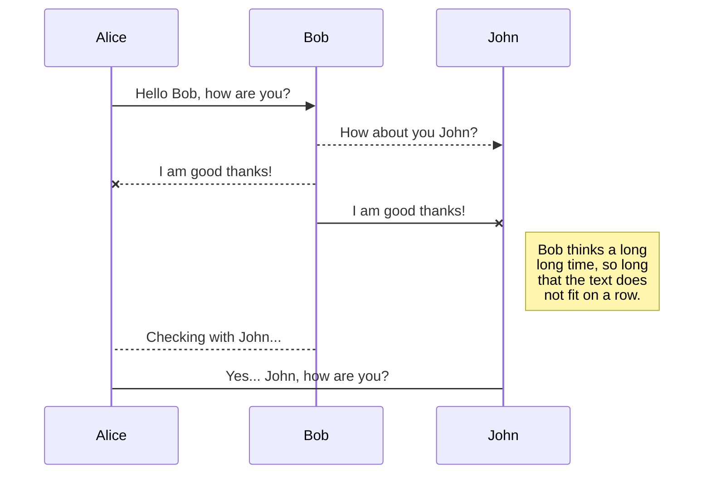
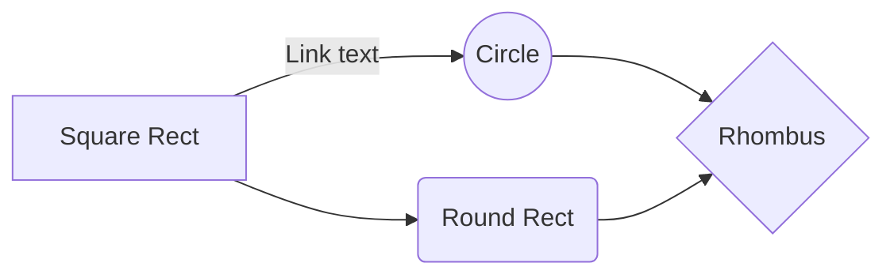

# Welcome to the custom watchface tutorial / guide for Artems xdrip version for GRT 2e!

This guide will lead you throught all steps needed to adapt a watchface to fit xdrip. I'm not a nativ speaker, so feel free to suggest changes.
This guide focus on adapting an existing watchface to our need. If you are creative and skilled enough to create your own watchface, this tutorial will help you with the technical adaptions to use it in xdrip.

Please remember this guide is only for **GTR 2e**! A lot of things are similiar for different watches especially the GTR 2 and GTS 2(e). If you using this guide to create watchfaces for different watches please send text snipets via issue to help this guide suite different watches aswell. 

Main credit goes to **Artem Kovalenko** who made Amazfit GTR2, GTR2e, GTS2, GTS2e, GTR42, Bip, BIP S and GTR 47 possible! Moreover he helped me a lot to create my first own watchface.
#### Please support him here: https://www.patreon.com/xdrip_miband
You can read more about his projects regarding xdrip here: https://bigdigital.home.blog/

Moreover thanks to:

 - [**SashaCX75**](https://amazfitwatchfaces.com/forum/memberlist.php?mode=viewprofile&u=113690) helped creating the watchfaceditor 
 - all watchface creator

## Things you need

I'll use the following tools. You will need all of them. All of the tools below are free for personl use.

1. Windows OS
2. **WFE**: [AmazFit WatchFace editor 2 for Windows](https://amazfitwatchfaces.com/forum/viewtopic.php?p=8392#p8392)
3. **PS**: Photoshop (Version CS2 is available for free) I only have a german link, but you should be able to dowenload it for free, no need for scetchy downloads. https://www.chip.de/downloads/Photoshop-CS2-kostenlos-Vollversion_59762951.html
4. **WF**: A watchface. (next chapter)

## Look for a watchface you would like to use

If you are not creating your own watchface, you can have alook for watchfaces here: https://amazfitwatchfaces.com/gtr/top?compatible=GTR_2
Donwload the desired file. Please watch care about the watch the watchface was made for.

**Something very important:** 

 - The smaller the watchface the better. We'll come to this later but all pictures inlcuding the json file should'nt be bigger than 50kb. 
 - 50kb watchface size (raw pictures and the json) will result in a uploadtime of about 10 seconds and you dont want it to take it longer, because of battery life and you dont want to wait untill tomorrow.
 - That means less icons, less changing things (excluding numbers, and yes only numbers). 
 - Avoide watchfaces with gradients (when one color shifts to another). 
 - Remember we want to be able to easily read our Blood Glucose (BG), so we need to make some free space somewhere. I would calculate at least 1/3 of the watchface dedicated to all xdrip related information

# Guide / Tutorial

1. Download the whole folder of the latest version of the WFE (watchface editor), linked above. 
2. You can find the "download" buttom in the top right, we need the whole folder! 
3. After clicking download choose "direct download". It will download a file like "AmazFit_Watchface_Editor_2_v5.1.zip".
4. Extract the file
5. Open (in my case) "AmazFit_Watchface_Editor_2"
6. start "AmazFit_Watchface_Editor_2.exe"
7. Buttom right, choose "Unpack compressed bin"
8. Choose the watchface you downloaded earlier
9. Now you need to get familiar with the WFE.
10. I'll explane only the absolut basics. To learn more about the watchface editor and its possibilities, have a look here: https://amazfitwatchfaces.com/forum/viewtopic.php?f=14&t=1571
Direct link to english translation:  https://translate.google.com/translate?hl=ru&sl=ru&tl=en&u=https%3A%2F%2Fowagner.ru%2Famazfitgtr%2Fwfcreator%2Fwatchfaces_creator_lesson%2F
11. Go to the Edit tab and click throught the different options on the right side. 
12. Choose "Layer order" to define things like the date order (dd-mm-yy or mm-dd-yy).

Important hint:
Our most important goal is to reduce size.

## Rename a file
## Rename a file
## Rename a file
## Rename a file
## Rename a file

You can rename the current file by clicking the file name in the navigation bar or by clicking the **Rename** button in the file explorer.

## Delete a file

You can delete the current file by clicking the **Remove** button in the file explorer. The file will be moved into the **Trash** folder and automatically deleted after 7 days of inactivity.

## Export a file

You can export the current file by clicking **Export to disk** in the menu. You can choose to export the file as plain Markdown, as HTML using a Handlebars template or as a PDF.

# Synchronization

Synchronization is one of the biggest features of StackEdit. It enables you to synchronize any file in your workspace with other files stored in your **Google Drive**, your **Dropbox** and your **GitHub** accounts. This allows you to keep writing on other devices, collaborate with people you share the file with, integrate easily into your workflow... The synchronization mechanism takes place every minute in the background, downloading, merging, and uploading file modifications.

There are two types of synchronization and they can complement each other:

- The workspace synchronization will sync all your files, folders and settings automatically. This will allow you to fetch your workspace on any other device.
	> To start syncing your workspace, just sign in with Google in the menu.

- The file synchronization will keep one file of the workspace synced with one or multiple files in **Google Drive**, **Dropbox** or **GitHub**.
	> Before starting to sync files, you must link an account in the **Synchronize** sub-menu.

## Open a file

You can open a file from **Google Drive**, **Dropbox** or **GitHub** by opening the **Synchronize** sub-menu and clicking **Open from**. Once opened in the workspace, any modification in the file will be automatically synced.

## Save a file

You can save any file of the workspace to **Google Drive**, **Dropbox** or **GitHub** by opening the **Synchronize** sub-menu and clicking **Save on**. Even if a file in the workspace is already synced, you can save it to another location. StackEdit can sync one file with multiple locations and accounts.

## Synchronize a file

Once your file is linked to a synchronized location, StackEdit will periodically synchronize it by downloading/uploading any modification. A merge will be performed if necessary and conflicts will be resolved.

If you just have modified your file and you want to force syncing, click the **Synchronize now** button in the navigation bar.

> **Note:** The **Synchronize now** button is disabled if you have no file to synchronize.

## Manage file synchronization

Since one file can be synced with multiple locations, you can list and manage synchronized locations by clicking **File synchronization** in the **Synchronize** sub-menu. This allows you to list and remove synchronized locations that are linked to your file.

# Publication

Publishing in StackEdit makes it simple for you to publish online your files. Once you're happy with a file, you can publish it to different hosting platforms like **Blogger**, **Dropbox**, **Gist**, **GitHub**, **Google Drive**, **WordPress** and **Zendesk**. With [Handlebars templates](http://handlebarsjs.com/), you have full control over what you export.

> Before starting to publish, you must link an account in the **Publish** sub-menu.

## Publish a File

You can publish your file by opening the **Publish** sub-menu and by clicking **Publish to**. For some locations, you can choose between the following formats:

- Markdown: publish the Markdown text on a website that can interpret it (**GitHub** for instance),
- HTML: publish the file converted to HTML via a Handlebars template (on a blog for example).

## Update a publication

After publishing, StackEdit keeps your file linked to that publication which makes it easy for you to re-publish it. Once you have modified your file and you want to update your publication, click on the **Publish now** button in the navigation bar.

> **Note:** The **Publish now** button is disabled if your file has not been published yet.

## Manage file publication

Since one file can be published to multiple locations, you can list and manage publish locations by clicking **File publication** in the **Publish** sub-menu. This allows you to list and remove publication locations that are linked to your file.

# Markdown extensions

StackEdit extends the standard Markdown syntax by adding extra **Markdown extensions**, providing you with some nice features.

> **ProTip:** You can disable any **Markdown extension** in the **File properties** dialog.

## SmartyPants

SmartyPants converts ASCII punctuation characters into "smart" typographic punctuation HTML entities. For example:

|                |ASCII                          |HTML                         |
|----------------|-------------------------------|-----------------------------|
|Single backticks|`'Isn't this fun?'`            |'Isn't this fun?'            |
|Quotes          |`"Isn't this fun?"`            |"Isn't this fun?"            |
|Dashes          |`-- is en-dash, --- is em-dash`|-- is en-dash, --- is em-dash|

## KaTeX

You can render LaTeX mathematical expressions using [KaTeX](https://khan.github.io/KaTeX/):

The *Gamma function* satisfying $\Gamma(n) = (n-1)!\quad\forall n\in\mathbb N$ is via the Euler integral

$$
\Gamma(z) = \int_0^\infty t^{z-1}e^{-t}dt\,.
$$

> You can find more information about **LaTeX** mathematical expressions [here](http://meta.math.stackexchange.com/questions/5020/mathjax-basic-tutorial-and-quick-reference).

## UML diagrams

You can render UML diagrams using [Mermaid](https://mermaidjs.github.io/). For example, this will produce a sequence diagram:

And this will produce a flow chart:

